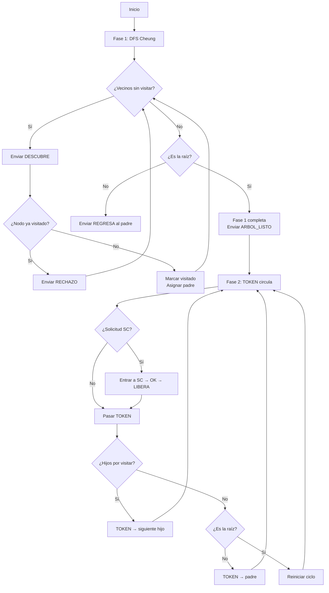

# Exclusión Mutua Distribuida mediante DFS de Cheung

## Descripción General

Este algoritmo resuelve el problema de **exclusión mutua distribuida** sobre **cualquier topología de red** (no solo anillos). Combina dos fases:

1. **Fase 1 — Construcción del árbol de expansión** (DFS de Cheung)
2. **Fase 2 — Circulación de TOKEN** sobre el árbol construido

La idea clave es que el DFS de Cheung construye un **árbol de expansión** sobre la gráfica arbitraria, y luego el TOKEN circula por ese árbol de manera cíclica (recorrido Euler), convirtiendo cualquier topología en una estructura donde se puede aplicar exclusión mutua basada en paso de testigo.

---

## Fase 1: DFS de Cheung — Construcción del Árbol

### Mensajes utilizados

| Mensaje      | Descripción                                                                 |
|-------------|-----------------------------------------------------------------------------|
| `INICIA`    | El nodo raíz inicia la exploración DFS                                     |
| `DESCUBRE`  | Se envía a un vecino no visitado para explorar                              |
| `RECHAZO`   | Respuesta de un nodo que ya fue visitado                                    |
| `REGRESA`   | Un nodo que terminó de explorar sus vecinos regresa al padre               |
| `ARBOL_LISTO` | La raíz notifica que el árbol DFS está completamente construido          |

### Funcionamiento

1. La **raíz** (nodo 1) inicia el DFS enviando `DESCUBRE` a sus vecinos.
2. Cada nodo al ser descubierto por primera vez:
   - Se marca como **visitado**
   - Registra al emisor como su **padre**
   - Continúa la exploración hacia sus propios vecinos no visitados
3. Si un nodo ya estaba visitado, responde con `RECHAZO`.
4. Cuando un nodo agota sus vecinos no visitados, envía `REGRESA` a su padre.
5. El padre registra al emisor como **hijo** en el árbol.
6. Cuando la raíz termina, envía `ARBOL_LISTO` a sus hijos, que lo propagan recursivamente.

### Resultado

Un **árbol de expansión** donde cada nodo conoce:
- Su **padre** (`self.padre`)
- Sus **hijos** (`self.hijos`)

---

## Fase 2: Exclusión Mutua — Recorrido del TOKEN

### Mensajes utilizados

| Mensaje     | Descripción                                                                |
|------------|----------------------------------------------------------------------------|
| `SOLICITUD`| El nodo decide (aleatoriamente) si quiere entrar a la sección crítica      |
| `TOKEN`    | El testigo que circula por el árbol DFS                                    |
| `OK`       | El nodo que tiene el TOKEN y solicitud pendiente entra a la sección crítica|
| `LIBERA`   | El nodo termina de usar la sección crítica y libera el TOKEN               |

### Funcionamiento (Recorrido Euler del árbol)

El TOKEN circula por el árbol DFS siguiendo un **recorrido Euler** (recorrido en profundidad cíclico):

```
        1 (raíz)
       / \
      2   3
     /
    4

Recorrido Euler: 1 → 2 → 4 → 2 → 1 → 3 → 1 → 2 → 4 → ...
```

1. Un nodo que recibe el TOKEN verifica si tiene una **solicitud pendiente**:
   - **Sí** → Envía `OK` a sí mismo (entra a la sección crítica), y al salir (`LIBERA`) continúa pasando el TOKEN.
   - **No** → Pasa el TOKEN inmediatamente al siguiente nodo.
2. El orden de paso es:
   - Si tiene hijos no visitados en este ciclo → envía TOKEN al **siguiente hijo**.
   - Si ya visitó todos sus hijos → devuelve TOKEN al **padre**.
   - Si es la raíz y ya visitó todos los hijos → **reinicia el ciclo**.

---

## Propiedades del Algoritmo

### Correctitud

| Propiedad             | Garantía | Explicación                                                                                      |
|-----------------------|----------|--------------------------------------------------------------------------------------------------|
| **Exclusión mutua**   | ✅ Sí    | Solo existe **un TOKEN** en todo el sistema. Solo el poseedor del TOKEN puede entrar a la SC.    |
| **Libre de deadlock** | ✅ Sí    | El TOKEN **siempre circula** por el árbol DFS; nunca se detiene permanentemente.                 |
| **Libre de inanición**| ✅ Sí    | El recorrido Euler garantiza que el TOKEN **visita todos los nodos** cíclicamente.               |

### Complejidad

| Métrica                          | Valor                    | Explicación                                                    |
|----------------------------------|--------------------------|----------------------------------------------------------------|
| **Mensajes DFS (Fase 1)**       | `O(2·E)`                | Cada arista se recorre a lo sumo 2 veces (DESCUBRE + RECHAZO/REGRESA) |
| **Mensajes por ciclo del TOKEN** | `O(2·(N-1))`           | El recorrido Euler de un árbol con N nodos visita 2·(N-1) aristas |
| **Mensajes por entrada a SC**   | `O(N)`                  | En el peor caso, el TOKEN debe recorrer todo el árbol           |
| **Latencia máxima (por SC)**    | `O(N)`                  | Proporcional al diámetro del árbol DFS                          |

Donde:
- `N` = número de nodos
- `E` = número de aristas

### Comparación con el algoritmo de anillo

| Aspecto              | Anillo (TOKEN Ring)       | DFS Cheung + TOKEN             |
|----------------------|---------------------------|--------------------------------|
| **Topología**        | Solo anillos              | **Cualquier topología**        |
| **Fase previa**      | No requiere               | Requiere DFS (Fase 1)         |
| **Mensajes por SC**  | `O(N)`                   | `O(N)` (sobre el árbol)       |
| **Complejidad total**| `O(N)` por ciclo          | `O(2E) + O(N)` por ciclo      |
| **Flexibilidad**     | Baja                      | **Alta**                       |

---

## Ejecución

```bash
# Ejecutar con cualquier gráfica de comunicaciones
python DFSCheung_exclusion.py g1.txt    # Estrella (7 nodos)
python DFSCheung_exclusion.py g2.txt    # Anillo (6 nodos)
python DFSCheung_exclusion.py g3.txt    # Gráfica general (6 nodos)
python DFSCheung_exclusion.py g4.txt    # Gráfica con componente
```

### Parámetros configurables

| Parámetro         | Ubicación            | Valor por defecto | Descripción                              |
|-------------------|----------------------|-------------------|------------------------------------------|
| Tiempo máximo     | `Simulation(_, 50)`  | 50                | Tiempo máximo de simulación              |
| Probabilidad SC   | `random.choice`      | 1/4 (25%)         | Probabilidad de solicitar sección crítica|
| Nodo raíz         | `Event("INICIA",_,1,1)` | Nodo 1         | Nodo que inicia la exploración DFS       |

---

## Diagrama de flujo del algoritmo



---

## Archivos del proyecto

| Archivo                    | Descripción                                         |
|---------------------------|-----------------------------------------------------|
| `DFSCheung_exclusion.py`  | Implementación del algoritmo                        |
| `DFSCheung.py`            | DFS de Cheung original (solo Fase 1)                |
| `Anillo.py`               | Exclusión mutua en anillo (referencia)              |
| `model.py`                | Clase base abstracta para modelos                   |
| `event.py`                | Clase Event (nombre, tiempo, destino, fuente)       |
| `simulation.py`           | Motor de simulación y gestión de la gráfica         |
| `g*.txt`                  | Gráficas de comunicaciones (topologías de prueba)   |

---

## Autores y contexto

- **Algoritmo base**: DFS de Cheung para construcción de árboles de expansión distribuidos
- **Extensión**: Exclusión mutua generalizada mediante circulación de TOKEN sobre el árbol DFS
- **Curso**: Simulador de Algoritmos Distribuidos — UAM 26P
