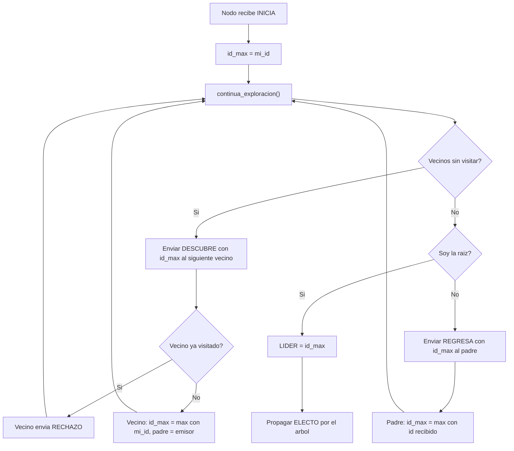

# Eleccion de Lider en Topologia General mediante DFS de Cheung

## Problema

El algoritmo LCR (LeLann-Chang-Roberts) resuelve la eleccion de lider de forma elegante, pero **solo funciona en anillos**. En una topologia general (mallas, estrellas, graficas arbitrarias) no existe un "sucesor" natural al cual reenviar candidaturas.

La idea clave es: **usar el DFS de Cheung como mecanismo de recorrido** para transportar las candidaturas por toda la red, combinandolo con la logica de comparacion de IDs del LCR.

---

## Componentes base

### Del DFS de Cheung tomamos:

- La capacidad de **recorrer todos los nodos** de una grafica arbitraria de forma ordenada
- La construccion implicita de un **arbol de expansion** (relacion padre-hijo)
- Los mensajes: `INICIA`, `DESCUBRE`, `RECHAZO`, `REGRESA`

### Del Anillo LCR tomamos:

- El principio de **comparacion de IDs**: si recibes un ID mayor al tuyo, lo reenvas; si es menor, lo descartas
- La deteccion de lider: cuando tu propia candidatura regresa a ti, eres el lider
- El mensaje `ELECTO` para notificar a todos

---

## Principios del Algoritmo

### Fase 1: Exploracion DFS con propagacion del ID maximo

En lugar de hacer el DFS solo para construir un arbol, **cada mensaje DESCUBRE lleva consigo el ID maximo conocido hasta el momento**. Asi, el recorrido DFS sirve simultaneamente para:

1. Recorrer todos los nodos
2. Propagar y comparar IDs (como en LCR, pero sobre el arbol DFS)

#### Reglas para cada nodo:

| Situacion | Accion |
|-----------|--------|
| Recibe `INICIA` | Registra su propio ID como `id_max_conocido`, inicia el DFS |
| Recibe `DESCUBRE(id_candidato)` y no esta visitado | Se marca visitado, adopta padre, actualiza `id_max_conocido = max(propio, recibido)`, continua exploracion propagando `id_max_conocido` |
| Recibe `DESCUBRE(id_candidato)` y ya esta visitado | Envia `RECHAZO` (igual que en DFS Cheung) |
| Recibe `REGRESA(id_max_subarbol)` | Actualiza `id_max_conocido = max(propio, recibido)`, continua exploracion |
| Agota vecinos sin visitar y no es raiz | Envia `REGRESA(id_max_conocido)` al padre |
| Agota vecinos sin visitar y es raiz | El `id_max_conocido` de la raiz es el **lider global** |

#### Flujo en pseudocodigo:

```
Al recibir DESCUBRE(id_candidato):
    si NO visitado:
        visitado = True
        padre = emisor
        id_max_conocido = max(mi_id, id_candidato)
        continua_exploracion()              # propaga id_max_conocido
    si YA visitado:
        enviar RECHAZO al emisor

Al recibir REGRESA(id_max_hijo):
    id_max_conocido = max(id_max_conocido, id_max_hijo)
    continua_exploracion()

continua_exploracion():
    si quedan vecinos sin visitar:
        enviar DESCUBRE(id_max_conocido) al siguiente vecino
    sino:
        si no soy raiz:
            enviar REGRESA(id_max_conocido) al padre
        sino:
            # id_max_conocido tiene el ID maximo de toda la red
            lider = id_max_conocido
```

### Fase 2: Notificacion del lider (mensaje ELECTO)

Una vez que la raiz determina al lider, debe **notificar a todos los nodos**. Esto se hace propagando un mensaje `ELECTO` por el arbol DFS construido en la Fase 1:

```
La raiz envia ELECTO(id_lider) a todos sus hijos
Cada hijo:
    - Registra id_lider
    - Propaga ELECTO(id_lider) a sus propios hijos
    - Si no tiene hijos, termina
```

---

## Mensajes del Algoritmo

| Mensaje | Parametros | Descripcion |
|---------|-----------|-------------|
| `INICIA` | — | Arranca la exploracion en el nodo iniciador |
| `DESCUBRE` | `id_candidato` | Explora un vecino y lleva el ID maximo conocido |
| `RECHAZO` | — | El vecino ya fue visitado |
| `REGRESA` | `id_max_subarbol` | El hijo termino y reporta el maximo de su sub-arbol |
| `ELECTO` | `id_lider` | Notifica el lider elegido a todos los nodos |

> **Nota**: En el simulador, el 5to parametro del constructor `Event(nombre, tiempo, destino, origen, dato)` se accede como una tupla con `event.getName()`, donde `getName()[0]` es el nombre del mensaje y `getName()[1]` es el dato adicional (el ID). Este es el mismo patron que usa [AnilloLCR.py](file:///c:/Users/PC/Documents/UAM/26P/Simulador/Simulador/AnilloLCR.py).

---

## Ejemplo Visual

Consideremos la siguiente grafica con 5 nodos (nodo 1 inicia):

```
    1 --- 2
    |     |
    4 --- 3
    |
    5
```

IDs unicos de cada nodo: {1, 2, 3, 4, 5}

### Traza del algoritmo:

```
1. Nodo 1 recibe INICIA
   id_max = 1
   Envia DESCUBRE(1) a nodo 2

2. Nodo 2 recibe DESCUBRE(1)
   visitado, padre = 1
   id_max = max(2, 1) = 2
   Envia DESCUBRE(2) a nodo 3

3. Nodo 3 recibe DESCUBRE(2)
   visitado, padre = 2
   id_max = max(3, 2) = 3
   Envia DESCUBRE(3) a nodo 4

4. Nodo 4 recibe DESCUBRE(3)
   visitado, padre = 3
   id_max = max(4, 3) = 4
   Envia DESCUBRE(4) a nodo 1 --> ya visitado --> RECHAZO
   Envia DESCUBRE(4) a nodo 5

5. Nodo 5 recibe DESCUBRE(4)
   visitado, padre = 4
   id_max = max(5, 4) = 5
   Sin vecinos --> REGRESA(5) a nodo 4

6. Nodo 4: id_max = max(4, 5) = 5
   Sin vecinos --> REGRESA(5) a nodo 3

7. Nodo 3: id_max = max(3, 5) = 5
   Sin vecinos --> REGRESA(5) a nodo 2

8. Nodo 2: id_max = max(2, 5) = 5
   Sin vecinos --> REGRESA(5) a nodo 1

9. Nodo 1 (raiz): id_max = max(1, 5) = 5
   LIDER = 5
   Propaga ELECTO(5) por el arbol
```

### Arbol DFS resultante:

```
        1 (raiz)
        |
        2
        |
        3
        |
        4
        |
        5  <-- LIDER
```

---

## Comparacion: LCR en Anillo vs DFS+Eleccion en Topologia General

| Aspecto | LCR en Anillo | DFS + Eleccion |
|---------|--------------|----------------|
| **Topologia** | Solo anillos | **Cualquier grafica conexa** |
| **Recorrido** | Circular (sucesor fijo) | DFS sobre arbol de expansion |
| **Mensajes Fase 1** | `O(N^2)` peor caso | `O(2*E)` (cada arista se usa maximo 2 veces) |
| **Mensajes Fase 2** | `O(N)` (ELECTO circula) | `O(N-1)` (ELECTO baja por el arbol) |
| **Total mensajes** | `O(N^2)` | `O(E + N)` |
| **Concurrencia** | Multiples candidaturas simultaneas | Una sola exploracion secuencial |
| **Nodo iniciador** | Cualquiera (o varios) | Un nodo arbitrario inicia el DFS |

---

## Propiedades de Correctitud

| Propiedad | Garantia | Justificacion |
|-----------|----------|---------------|
| **Seguridad** (se elige exactamente un lider) | Si | El DFS visita **todos** los nodos exactamente una vez; el `max` se propaga de regreso y converge en la raiz |
| **Vivacidad** (el algoritmo termina) | Si | El DFS de Cheung siempre termina en graficas finitas conexas; `ELECTO` se propaga por todo el arbol |
| **Unicidad** | Si | Los IDs son unicos; `max` sobre un conjunto finito tiene un unico resultado |

---

## Variante: Multiples Iniciadores

Si mas de un nodo inicia el DFS simultaneamente (como en LCR donde varios despiertan), se necesita una regla adicional:

- Si un nodo **ya visitado** recibe un `DESCUBRE` con un `id_candidato` **mayor** que su `id_max_conocido`, podria actualizar su maximo y propagarlo. Sin embargo, esto rompe la estructura del DFS.

**Solucion mas simple**: Designar un unico iniciador (como ya hace el DFS de Cheung original con el nodo 1). El algoritmo garantiza que todos los nodos seran visitados desde ese unico punto de partida.

**Solucion alternativa**: Permitir multiples DFS concurrentes, donde cada "ola" de exploracion lleva su propio ID candidato. Las olas con IDs menores son absorbidas por las olas con IDs mayores (similar al algoritmo de inundacion con extincion). Esta variante es mas compleja pero permite inicio espontaneo.

---

## Diagrama de Flujo



---

## Archivos de Referencia

| Archivo | Descripcion | Aporte al algoritmo |
|---------|-------------|---------------------|
| [DFSCheung.py](file:///c:/Users/PC/Documents/UAM/26P/Simulador/Simulador/DFSCheung.py) | DFS de Cheung original | Mecanismo de recorrido (DESCUBRE, RECHAZO, REGRESA) |
| [AnilloLCR.py](file:///c:/Users/PC/Documents/UAM/26P/Simulador/Simulador/AnilloLCR.py) | Eleccion LCR en anillo | Logica de comparacion de IDs y mensaje ELECTO |
| [model.py](file:///c:/Users/PC/Documents/UAM/26P/Simulador/Simulador/model.py) | Clase base Model | Framework del simulador |
| [event.py](file:///c:/Users/PC/Documents/UAM/26P/Simulador/Simulador/event.py) | Clase Event | Soporte para dato adicional via tupla en name |
